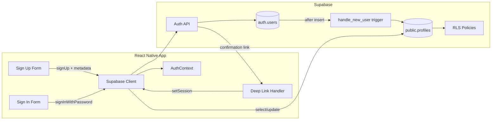

# Supabase Auth Flow — Phased Implementation Plan

## Context

- **App**: Mall-E (Expo / React Native), [App.tsx](App.tsx) uses `UserProvider` and [AppNavigator](src/navigation/AppNavigator.tsx) (native stack + bottom tabs). No Supabase client yet.
- **UserContext** ([src/context/UserContext.tsx](src/context/UserContext.tsx)) holds local preferences (favorites, lists, subscribed stores); auth state and profile will be separate (new AuthContext + optional profile merge).
- **Secrets**: [.gitignore](.gitignore) already excludes `.env` and `.env.local`; no `.env.example` yet. Publishable key will be client-visible; **service_role key must never be in the app** — RLS is the main protection.

---

## Phase 1 — Supabase dashboard setup

All steps in this phase are done in the **Supabase Dashboard** (Project → Auth, SQL Editor, Table Editor, Database → Roles).

### 1.1 Auth provider and email confirmation

- **Where**: Dashboard → **Authentication** → **Providers** → Email.
- **Config**:
  - Keep **Email** enabled.
  - **Enable Email Confirmations**: ON (recommended).
- **Trade-off if you disable**: Without confirmation, anyone can sign up with any email and get immediate access. Enabling it prevents fake accounts and ensures you can reach users; downside is users must click the link before signing in. For production, keep it ON.
- **Security**: Confirmation links use one-time tokens; after use they are invalidated.

### 1.2 Site URL and redirect URLs (for email links)

- **Where**: **Authentication** → **URL Configuration**.
- **Site URL**: `http://localhost:3000` (or your production web URL when you have one). For mobile-only, this is mainly used as fallback; the real redirect for confirmation emails is the custom scheme below.
- **Redirect URLs**: Add:
  - `com.celestialdragonfly.malle://`** — so confirmation and magic-link emails can open the app.
  - For local/dev: `exp://192.168.x.x:8081/--/` or similar if you test with Expo Go (optional).
- **Security**: Only URLs in this list are accepted as `emailRedirectTo`; prevents redirect to attacker-controlled domains.

### 1.3 Email templates (optional but recommended)

- **Where**: **Authentication** → **Email Templates**.
- **Confirm signup**: Customize subject/body if desired. Ensure the template uses `{{ .ConfirmationURL }}` so the link points to your redirect URL (Supabase will append tokens). For deep link back to app, the confirmation URL will use the redirect URL you pass from the client (see Phase 3).

### 1.4 Create `profiles` table and link to `auth.users`

- **Where**: **SQL Editor** (or Table Editor for table, then SQL for RLS/policies).
- **Schema**: One row per user; `id` is the only link to auth.

```sql
-- profiles table: id matches auth.users, cascade on delete
create table public.profiles (
  id uuid not null references auth.users on delete cascade,
  username text,
  first_name text,
  last_name text,
  created_at timestamptz not null default now(),
  updated_at timestamptz not null default now(),
  primary key (id)
);

-- Optional: unique username for display/handles (add after RLS if you want)
-- create unique index profiles_username_key on public.profiles (lower(username));
-- alter table public.profiles add constraint profiles_username_key unique using index profiles_username_key;

comment on table public.profiles is 'User profile data; id is auth.users.id';
```

- **Security**: `on delete cascade` keeps profiles in sync when a user is deleted from Auth.

### 1.5 Trigger: create profile on sign-up (recommended)

- **Where**: **SQL Editor**.
- **Why trigger over app-only insert**: If you only insert from the client, a failed or skipped insert (e.g. network, bug) leaves `auth.users` without a profile; then you need defensive "create profile if missing" logic everywhere. A trigger guarantees a profile row for every new user; metadata is already in `raw_user_meta_data` at insert time.
- **Gotcha**: If the trigger fails, the whole sign-up transaction fails and the user is not created. So keep the function simple, use `security definer set search_path = ''` to avoid search_path hijacking, and test (e.g. sign up once) before relying on it.

```sql
-- Create profile from auth.users insert; reads from raw_user_meta_data
create or replace function public.handle_new_user()
returns trigger
language plpgsql
security definer set search_path = ''
as $$
begin
  insert into public.profiles (id, username, first_name, last_name, updated_at)
  values (
    new.id,
    coalesce(new.raw_user_meta_data ->> 'username', ''),
    coalesce(new.raw_user_meta_data ->> 'first_name', ''),
    coalesce(new.raw_user_meta_data ->> 'last_name', ''),
    now()
  );
  return new;
end;
$$;

create trigger on_auth_user_created
  after insert on auth.users
  for each row execute procedure public.handle_new_user();
```

- **Security**: `set search_path = ''` prevents privilege escalation via search_path; only `public.profiles` is written.

### 1.6 Enable RLS on `profiles`

- **Where**: **SQL Editor** (or Table Editor → profiles → RLS).

```sql
alter table public.profiles enable row level security;
```

- **Security**: Without RLS, the publishable key could read/update all rows. With RLS, only policies you define apply.

### 1.7 RLS policies for `profiles`

- **Where**: **SQL Editor** (or Database → Policies).
- **Principle**: Authenticated users can read/update only their own row (where `id = auth.uid()`). No unauthenticated access to profiles.

```sql
-- Users can read their own profile
create policy "Users can read own profile"
  on public.profiles for select
  to authenticated
  using (id = auth.uid());

-- Users can update their own profile (e.g. username, first_name, last_name)
create policy "Users can update own profile"
  on public.profiles for update
  to authenticated
  using (id = auth.uid())
  with check (id = auth.uid());

-- No insert from client: trigger does it. If you ever need client insert (e.g. backfill), restrict:
-- create policy "Users can insert own profile" on public.profiles for insert to authenticated with check (id = auth.uid());
```

- **Security**: `authenticated` role is set by Supabase when a valid JWT is present; `auth.uid()` is the user id from that JWT. Requests with the publishable key but no valid token cannot pass these policies.

### 1.8 (Optional) Revoke default public access

- **Where**: **SQL Editor**.

```sql
revoke all on public.profiles from anon;
revoke all on public.profiles from authenticated;
grant select, update on public.profiles to authenticated;
```

- **Security**: Explicit grants; RLS still applies. Default Supabase setup may already restrict the `anon` role; this makes it explicit. (PostgreSQL role name remains `anon`; Supabase’s client-facing key is now called the publishable key.)

---

## Phase 2 — Environment and project setup

Mix of **repo files** and **Supabase Dashboard** (copy keys).

### 2.1 Environment variables and .gitignore

- **Where**: Project root.
- **Create `.env.example`** (committed; no real secrets):

```bash
# Supabase (client-safe: publishable key is designed to be public; RLS protects data)
EXPO_PUBLIC_SUPABASE_URL=https://YOUR_PROJECT_REF.supabase.co
EXPO_PUBLIC_SUPABASE_PUBLISHABLE_KEY=your_publishable_key_here
```

- **Do not commit**: `.env` and `.env.local` (already in [.gitignore](.gitignore)). Never add `SUPABASE_SERVICE_ROLE_KEY` or any server-only secret to the app.
- **Security**: Publishable key is meant to be client-visible; all real protection is RLS + Auth. Service role key bypasses RLS — use only on a secure backend.

### 2.2 EAS / production builds (if using EAS)

- **Where**: `eas.json` or EAS Dashboard → Project → Secrets.
- **Option A**: EAS Secrets for `EXPO_PUBLIC_SUPABASE_URL` and `EXPO_PUBLIC_SUPABASE_PUBLISHABLE_KEY`, then reference in `eas.json` env.
- **Option B**: In `eas.json` build profiles, set `env` with non-secret values; for the publishable key you can use a secret variable.
- **Expo**: Only variables prefixed with `EXPO_PUBLIC_` are available in client code. Do not put service role key in EAS env that is exposed to the client.

### 2.3 Install dependencies

- **Where**: Repo root.

```bash
npm install @supabase/supabase-js @react-native-async-storage/async-storage
```

- **Note**: `@react-native-async-storage/async-storage` is already in [package.json](package.json). Supabase JS client uses it for session persistence in React Native when you pass it in the client options.

### 2.4 Supabase client initialisation

- **Where**: New file e.g. `src/lib/supabase.ts` (or `src/utils/supabase.ts`).
- **Code**:
  - Read URL and publishable key from `process.env.EXPO_PUBLIC_SUPABASE_URL` and `process.env.EXPO_PUBLIC_SUPABASE_PUBLISHABLE_KEY`.
  - Create client with `createClient(url, publishableKey, { auth: { storage: AsyncStorage, autoRefreshToken: true, persistSession: true } })`.
  - Export the single client instance; use it for all auth and data calls.
- **Security**: Single client with persisted session and refresh; no service role key, no hardcoded keys.

### 2.5 Deep link scheme for email confirmation

- **Where**: [app.json](app.json) (Expo config).
- **Add** under `expo`: `"scheme": "com.celestialdragonfly.malle"`. This registers the custom URL scheme so confirmation emails can open the app. The scheme should match the redirect URL you use in Supabase.
- **Supabase**: Redirect URL in Phase 1.2 must be `com.celestialdragonfly.malle://`** (already configured).

---

## Phase 3 — Auth flow implementation

All in **code** (new/updated files under `src/`).

### 3.1 Auth context and session state

- **Where**: New `src/context/AuthContext.tsx`.
- **Responsibilities**:
  - Expose: `session`, `user`, `profile` (from `profiles`), `loading`, `signUp`, `signIn`, `signOut`, `refreshProfile`.
  - On mount: `supabase.auth.getSession()` then `supabase.auth.onAuthStateChange()` to keep session/user in state.
  - When `user` is set and you have a profile table: fetch `profiles` row where `id = user.id` (single row) and store in state; expose as `profile`.
  - Use AsyncStorage via Supabase client options (Phase 2.4) so session survives app restarts.
- **Security**: Do not store passwords or tokens in context beyond what Supabase stores in AsyncStorage; let the client handle tokens.

### 3.2 Sign-up with profile fields

- **Where**: Sign-up screen or form component.
- **Flow**: Call `supabase.auth.signUp({ email, password, options: { data: { username, first_name, last_name } } })`. Optionally pass `options.emailRedirectTo` (e.g. `makeRedirectUri()` from `expo-auth-session`) so the confirmation email redirects back to the app.
- **Redirect**: For React Native, set `emailRedirectTo` to your deep link, e.g. `com.celestialdragonfly.malle://auth/callback` (must be in Supabase redirect allow list; `com.celestialdragonfly.malle://`** covers this).
- **After sign-up**: If email confirmation is required, show a “Check your email” message; do not assume the user is signed in until the session exists (e.g. after they open the confirmation link).

### 3.3 Sign-in

- **Where**: Sign-in screen.
- **Flow**: `supabase.auth.signInWithPassword({ email, password })`. On success, `onAuthStateChange` fires and your AuthContext updates; redirect to main app (e.g. replace stack with MainTabs).

### 3.4 Session handling and redirect after email confirmation

- **Where**: App root (e.g. [App.tsx](App.tsx)) or a wrapper that has access to Linking.
- **Deep link handling**: Use `expo-linking`: `Linking.addEventListener('url', handler)` and/or `Linking.getInitialURL()` on startup. When the URL is your scheme (`com.celestialdragonfly.malle://...`), parse the fragment/query for `access_token` and `refresh_token` (Supabase appends them to the redirect URL), then call `supabase.auth.setSession({ access_token, refresh_token })`. After that, session state updates and you can navigate to the main app.
- **Reference**: Supabase docs “Native Mobile Deep Linking” and the pattern using `expo-auth-session`’s `makeRedirectUri` + `QueryParams.getQueryParams(url)` + `setSession`.
- **Flow**: User signs up → gets email → taps link → OS opens app with URL → app extracts tokens → `setSession` → AuthContext sees session → navigator shows authenticated stack.

### 3.5 Auth-aware navigation

- **Where**: [App.tsx](App.tsx) and [src/navigation/AppNavigator.tsx](src/navigation/AppNavigator.tsx) (or a new auth gate component).
- **Logic**: If `session == null` and not loading, show auth stack (Sign In / Sign Up). If session exists, show main app (e.g. existing MainTabs + ProductDetail). Optionally show a short “loading” state while `getSession()` or initial URL is resolved.
- **Structure**: Keep existing `UserProvider` and tab structure; wrap navigator with auth check so unauthenticated users only see auth screens.

### 3.6 Profile display and edit (optional for MVP)

- **Where**: Profile/settings screen.
- **Read**: From AuthContext `profile` (loaded in 3.1).
- **Update**: `supabase.from('profiles').update({ username, first_name, last_name }).eq('id', user.id)`. RLS allows only own row update.

---

## Phase 4 — Security hardening checklist

- **Where**: Mix of Supabase Dashboard and code.


| Item                           | Where           | What to do                                                                                                                                                                                         |
| ------------------------------ | --------------- | -------------------------------------------------------------------------------------------------------------------------------------------------------------------------------------------------- |
| RLS on `profiles`              | Dashboard / SQL | Ensure RLS is ON and only “read/update own” policies exist; no policy that allows unauthenticated access or `true` for all rows.                                                                   |
| No service role in app         | Repo / env      | Confirm no `SUPABASE_SERVICE_ROLE_KEY` or `service_role` in client code or in env vars that are bundled for the app.                                                                               |
| Publishable key scope          | Design          | Rely on RLS and Auth for protection; publishable key is public by design. Restrict which tables are exposed via PostgREST if needed.                                                               |
| Rate limiting                  | Dashboard       | Auth → Rate Limits: consider limiting sign-up and sign-in attempts per IP to reduce abuse.                                                                                                         |
| Input validation               | Code            | Validate email format and password length/strength before calling `signUp`/`signIn`; sanitise username/first_name/last_name (length, character set) to avoid abuse and broken metadata.            |
| Token expiry                   | Dashboard       | Auth → Settings: JWT expiry (default 3600) and refresh behaviour; shorter expiry + refresh is generally fine.                                                                                      |
| Email confirmation             | Dashboard       | Keep enabled in production; use deep link so confirmation opens the app and sets session.                                                                                                          |
| Redirect URL allow list        | Dashboard       | Only add URLs you control (your scheme + path); no wildcards that include third-party domains.                                                                                                     |
| Trigger robustness             | SQL             | Trigger uses `coalesce` for metadata; avoid heavy logic so sign-up never fails due to trigger.                                                                                                     |
| Username uniqueness (if added) | SQL             | If you add a unique constraint on `username`, handle conflict in app (e.g. “username taken”) and optionally add a policy that allows insert only for own `id` if you ever need client-side insert. |


---

## Supabase gotchas summary

1. **Trigger vs manual insert**: Prefer trigger for profile creation so every new user always has a profile; test the trigger so a failed insert doesn’t block sign-up.
2. **Metadata in trigger**: Profile fields must be passed in `options.data` on `signUp`; they appear in `raw_user_meta_data` and the trigger reads them with `->>`.
3. **Email confirmation**: If enabled, user is not “signed in” until they open the link and you call `setSession`; design UI for “check your email” and for opening the app from the link.
4. **Publishable key**: Safe to expose; never expose service_role key. RLS and Auth policies are what protect data.
5. **Redirect URL**: Must be in allow list in Dashboard; for mobile use a custom scheme and handle the URL in the app to call `setSession`.
6. **RLS**: Enable on every table that holds user data; default “allow all” policies are unsafe.

---

## Diagram (high-level auth + profile flow)




---

## File and dependency summary


| Item                                                | Action                                                                                                              |
| --------------------------------------------------- | ------------------------------------------------------------------------------------------------------------------- |
| `.env.example`                                      | Create with `EXPO_PUBLIC_SUPABASE_URL`, `EXPO_PUBLIC_SUPABASE_PUBLISHABLE_KEY`                                      |
| `.gitignore`                                        | Already has `.env`, `.env.local`                                                                                    |
| `app.json`                                          | Add `expo.scheme`: `"com.celestialdragonfly.malle"` (matches Supabase redirect `com.celestialdragonfly.malle://**`) |
| `src/lib/supabase.ts` (or `src/utils/supabase.ts`)  | New: createClient with AsyncStorage                                                                                 |
| `src/context/AuthContext.tsx`                       | New: session, user, profile, signUp, signIn, signOut, deep-link session handling                                    |
| `src/navigation/AppNavigator.tsx` or new `AuthGate` | Conditional auth stack vs main stack                                                                                |
| Sign-up / Sign-in screens                           | New or extend existing; call AuthContext methods and pass profile metadata on sign-up                               |
| `@supabase/supabase-js`                             | Add dependency                                                                                                      |
| `expo-linking`                                      | Use for URL listener and initial URL (likely already available via Expo)                                            |
| `expo-auth-session`                                 | Optional: `makeRedirectUri()` for `emailRedirectTo`                                                                 |


This plan gives you a numbered, phased path from Supabase dashboard setup through to a secure email/password auth flow with profiles and RLS, without committing secrets and with clear handling of the publishable key and email confirmation.